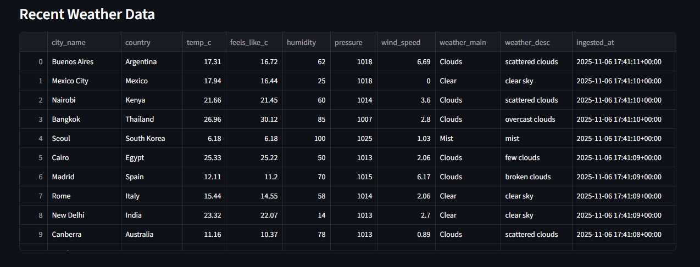

# 🌦️ Automated Data Warehouse


**Live App:** [https://automateddatawarehousejaheemedwards.streamlit.app/](https://automateddatawarehousejaheemedwards.streamlit.app/)

---

## Project Overview

The **Automated Data Warehouse** integrates weather data from the **OpenWeather API** with a curated list of **world capitals scraped from Wikipedia**. The data is stored in a **PostgreSQL database** (hosted on [Neon](https://neon.tech/)) and visualized in a **Streamlit dashboard**, allowing users to explore weather metrics over time.

The project is **fully autonomous**:

- ETL pipeline runs on a schedule via **GitHub Actions**.
- Streamlit dashboard updates dynamically with the latest data.
- No manual intervention is required once deployed.

---

## Features

### ETL Pipeline

- **City Data**
  - Scrapes a list of **world capitals** and their coordinates from Wikipedia.
  - Populates `dim_city` table with city name, latitude, longitude, and country.
- **Weather Data**
  - Fetches live weather information using **OpenWeather API**.
  - Populates `fact_weather` table with temperature, humidity, pressure, wind speed, weather description, and raw JSON.
- **Time Dimension**
  - `dim_time` table stores timestamp information (hour, day, month, year, weekday) for each ETL run.
- **Automation**
  - The pipeline runs every **two days** via **GitHub Actions** workflow.
  - Upserts ensure no duplicate data and maintain historical integrity.

### Data Warehouse Schema

**Dimension Tables:**

- `dim_city`  
  | Column     | Type              | Description                   |
  |------------|-----------------|-------------------------------|
  | city_id    | SERIAL PRIMARY KEY | Unique ID for city           |
  | city_name  | TEXT UNIQUE        | Name of the city             |
  | latitude   | DOUBLE PRECISION   | Latitude coordinate          |
  | longitude  | DOUBLE PRECISION   | Longitude coordinate         |
  | country    | TEXT               | Country of the city          |
  | updated_at | TIMESTAMPTZ        | Last update timestamp        |

- `dim_time`  
  | Column     | Type              | Description                  |
  |------------|-----------------|------------------------------|
  | time_id    | SERIAL PRIMARY KEY | Unique timestamp ID         |
  | ts         | TIMESTAMPTZ UNIQUE | Timestamp of weather data   |
  | date       | DATE              | Date portion of timestamp    |
  | hour       | INT               | Hour of day                  |
  | day        | INT               | Day of month                 |
  | month      | INT               | Month of year                |
  | year       | INT               | Year                          |
  | weekday    | INT               | Day of week (0=Monday)      |

**Fact Table:**

- `fact_weather`  
  | Column       | Type             | Description                             |
  |--------------|-----------------|-----------------------------------------|
  | weather_id   | SERIAL PRIMARY KEY | Unique ID for each weather record      |
  | city_id      | INT               | Foreign key to `dim_city`              |
  | time_id      | INT               | Foreign key to `dim_time`              |
  | source       | TEXT              | Data source (e.g., OpenWeather API)    |
  | temp_c       | DOUBLE PRECISION  | Temperature in Celsius                  |
  | feels_like_c | DOUBLE PRECISION  | Feels-like temperature                  |
  | humidity     | INT               | Humidity percentage                     |
  | pressure     | INT               | Atmospheric pressure                     |
  | wind_speed   | DOUBLE PRECISION  | Wind speed (m/s)                        |
  | weather_main | TEXT              | Main weather type (e.g., Clouds)       |
  | weather_desc | TEXT              | Detailed weather description            |
  | raw_json     | JSONB             | Raw API response                        |
  | ingested_at  | TIMESTAMPTZ       | Timestamp of data ingestion             |

---

## Tech Stack

- **Python 3.12** – ETL scripts, API integration, data processing
- **SQLAlchemy** – Database connection and ORM
- **PostgreSQL (Neon)** – Data warehouse storage
- **Streamlit** – Interactive dashboard
- **GitHub Actions** – Automation and scheduling of ETL pipeline
- **dotenv** – Managing environment variables securely

---

## Setup Instructions

### Local Setup

1. Clone the repo:

```bash
git clone https://github.com/jaheemedwards/Automated-Data-Warehouse.git
cd Automated-Data-Warehouse
````

2. Create a virtual environment and install dependencies:

```bash
python -m venv env
source env/bin/activate      # Linux / macOS
env\Scripts\activate         # Windows
pip install -r requirements.txt
```

3. Create a `.env` file in the project root with the following variables:

```dotenv
OPENWEATHER_API_KEY=your_openweather_api_key
DATABASE_URL=your_postgres_url
```

4. Initialize the database:

```bash
psql $DATABASE_URL -f warehouse/create_tables.sql
```

5. Run the ETL pipeline manually:

```bash
python scripts/etl_load.py
```

6. Start the dashboard locally:

```bash
streamlit run dashboard/app.py
```

---

### Deployment & Automation

* **Streamlit Cloud** hosts the dashboard, updating dynamically with the database.
* **GitHub Actions Workflow** (`.github/workflows/etl_schedule.yml`) automates ETL runs every two days:

```yaml
name: Scheduled ETL
on:
  schedule:
    - cron: "0 3 */2 * *"
  workflow_dispatch:
jobs:
  run-etl:
    runs-on: ubuntu-latest
    env:
      OPENWEATHER_API_KEY: ${{ secrets.OPENWEATHER_API_KEY }}
      DATABASE_URL: ${{ secrets.DATABASE_URL }}
    steps:
      - uses: actions/checkout@v3
      - uses: actions/setup-python@v4
        with:
          python-version: "3.12"
      - run: pip install -r requirements.txt
      - run: python scripts/etl_load.py
```

> With GitHub Actions and Streamlit Cloud combined, the project runs end-to-end autonomously.

---

## Project Workflow

1. **Scrape Wikipedia** for city names and coordinates.
2. **Fetch Weather Data** from OpenWeather API.
3. **Transform & Upsert** data into the PostgreSQL data warehouse.
4. **Visualize** metrics in the Streamlit dashboard for non-technical users.
5. **Automated Schedule** ensures ETL runs every 2 days without manual intervention.

---

## Screenshots




---

## Future Improvements

* Include additional data sources like air quality statistics.
* Add predictive weather analytics using historical data.
* Implement user-specific filters and city comparison features.
* Expand ETL to include more granular temporal updates (hourly weather data).

---

## License

MIT License © Jaheem Edwards
---